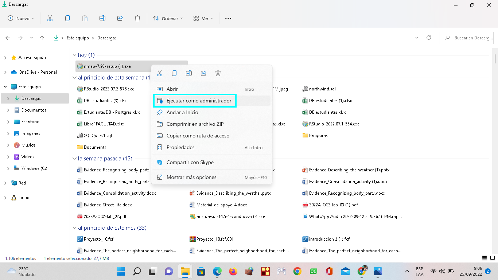

#  **NMAP**

## **Instalacion de la herramienta NMAP**

Para la instalación de esta herramienta es necesario ingresar a la [página principal de NMAP][1_1].

[1_1]:https://nmap.org/download.html

Una vez en la página principal, se le da click en el ícono de la imágen que esta remarcado para iniciar la descarga de **NMAP**.

Después de terminar la descarga, se ejecuta el programa como administrador, como se muestra en la imágen.

Para continuar con el proceso de isntalación se le deberá dar clic en el botón I Agree.

En el proceso de la instalación se agrega la ruta de instalación o se deja por defecto como en este caso y se le da click en el botón Install.

Una vez se haya realizado la configuración satisfactoriamente se le da click en el botón Next.

En este proceso de instalación se activan los dos cuadros, como se muestra en la imágen y se le da click en el botón Next.

El programa ha sido instalado en el computador y se le dará click en el botón Finish.

Una vez terminada la instalación del programa **NMAP** se deberá buscar el programa e ingresar a la terminal, tal como se muestra en la imágen.

 
Una vez ingresado a la terminal se podra ejecutar los diferentes comandos de la herramienta **NMAP**, como se muestra en la imágen.

|     18    |     `nmap localhost`    |     Este comando me permite obtener la dirección IP.    |
|---|---|---|
|     19    |     `nmap  127.0.0.1`    |     Este comando sirve para ver que puertos están activos.    |
|     20    |     `nmap -sP -n 127.0.0.0/240`   |     Este comando muestra todas las subredes desde la 0 hasta la 24.    |
|     21    |     `nmap -sP -n 127.0.0.100-110`    |     Este comando muestra todas las subredes desde la 100 hasta la 110.    |
|     22    |     `nmap -iL lista_ip.txt`    |     Este comando sirve para buscar archivos.    |
|     23    |     `nmap scanme.nmap.org`    |     Este comando sirve para ver una dirección web y hacer pruebas en esta.    |
|     24    |      `nmap 1.1.1.1 8.8.8.8`    |     Este comando sirve para escanear múltiples direcciones IP.    |
|     25    |     `nmap Udenar.edu.co`    |          |

